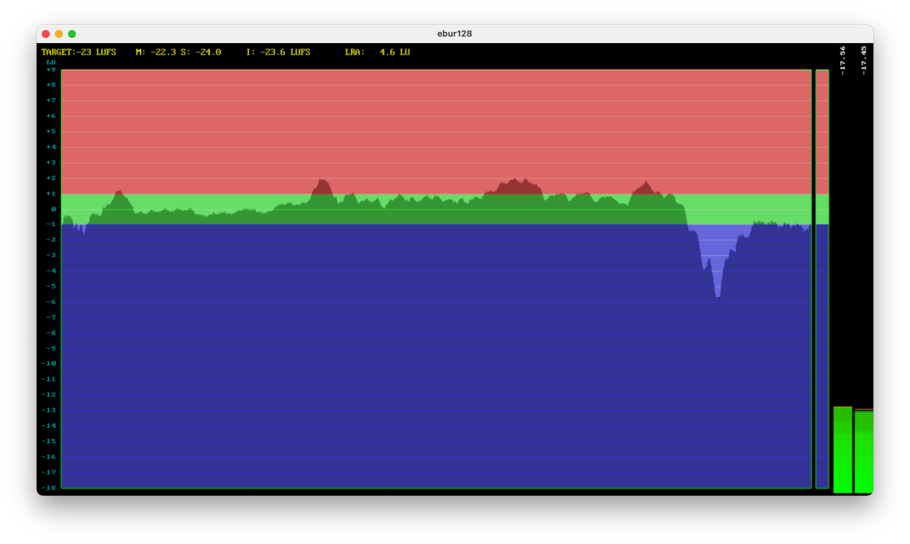
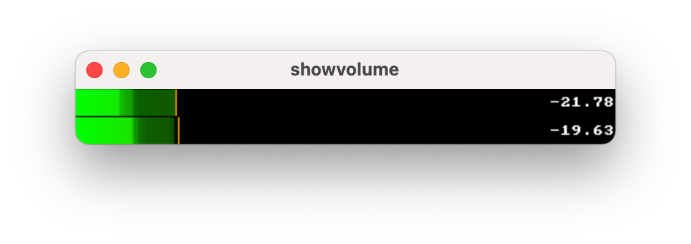
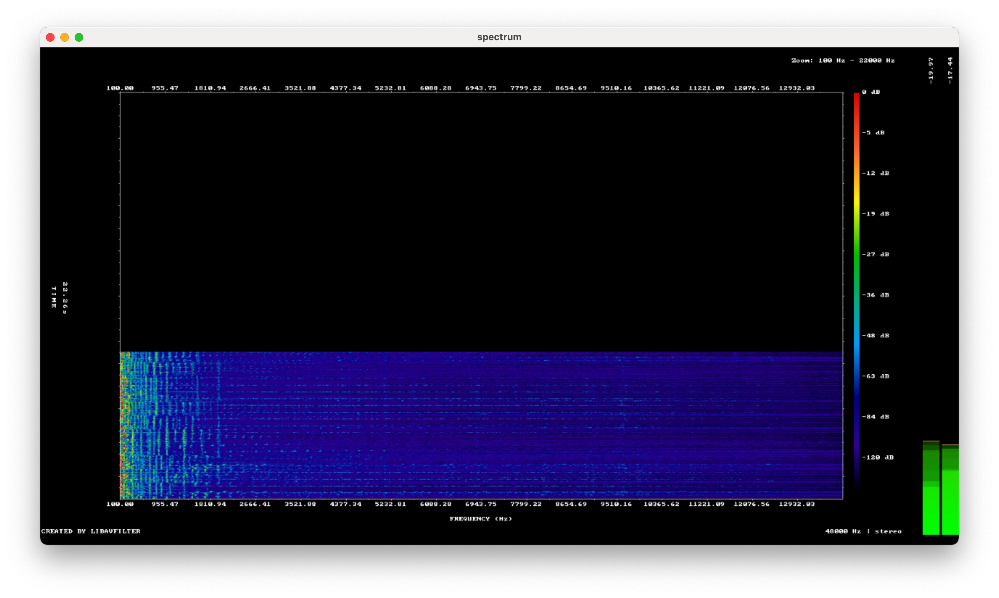
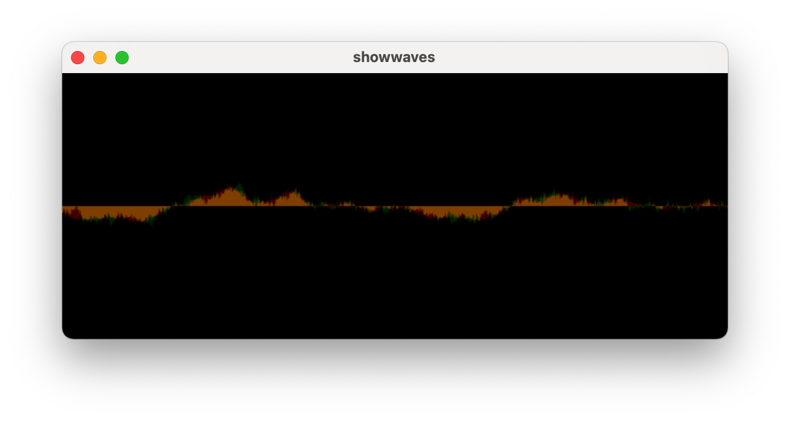

# aes67-visualization
Command line tool to easily launch ffmpeg audio visualizations from AES67 sdp files

## Installation
```
git clone https://github.com/philhartung/aes67-visualization.git
cd aes67-visualization
npm install
```
In addition to that, both [gstreamer](https://gstreamer.freedesktop.org/documentation/installing/index.html) (there is some issue with L24BE used in AES67 and ffmpeg, thats why gstreamer is used to convert audio) and [ffmpeg](https://ffmpeg.org/) need to be installed. 

## Usage
To display the help, execute `node main --help`:
```
Usage: main [options]

Options:
  -V, --version      output the version number
  -f, --file <file>  Input sdp file
  -t, --type <type>  Visualtization type: ebur128, spectrum, ahistogram, avectorscope, showcqt, showfreqs, showspatial, abitscope, showwaves, aphasemeter,
                     showvolume
  -h, --help         display help for command
```

## Examples
`node main -f pgm.sdp -t ebur128`:


`node main -f pgm.sdp -t showvolume`:


`node main -f pgm.sdp -t spectrum`:


`node main -f pgm.sdp -t showwaves`:


`pgm.sdp` is as AES67 sdp file from a Dante device in AES67 mode:
```
v=0
o=- 1206666431 1206666436 IN IP4 10.10.0.118
s=EXBOXMD : 31
i=2 channels: Ch 3, Ch 4
c=IN IP4 239.69.161.58/32
t=0 0
a=keywds:Dante
a=recvonly
m=audio 5004 RTP/AVP 97
a=rtpmap:97 L24/48000/2
a=ptime:1
a=ts-refclk:ptp=IEEE1588-2008:00-1D-C1-FF-FE-00-00-00:0
a=mediaclk:direct=0
```
